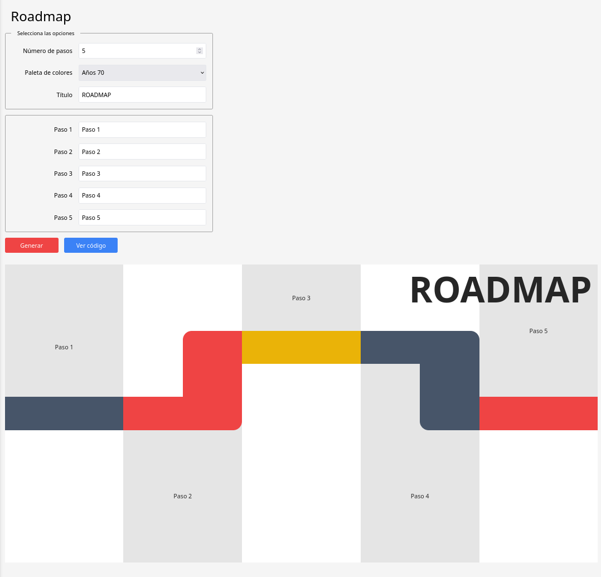
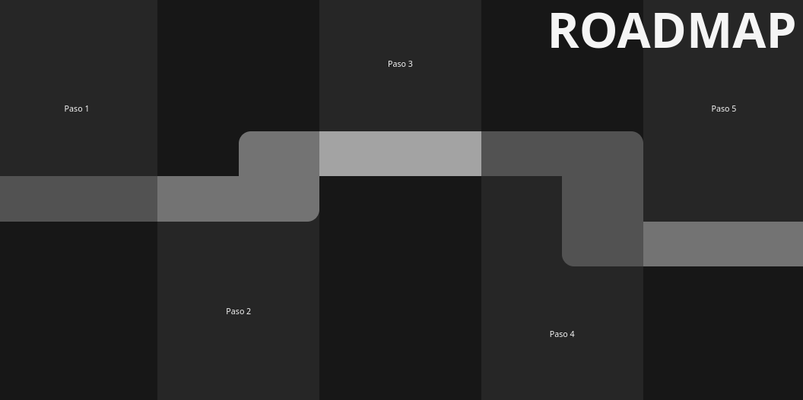
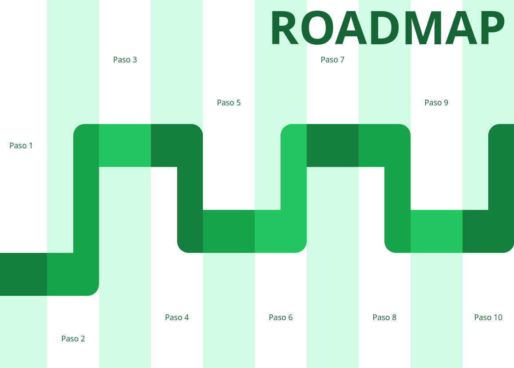
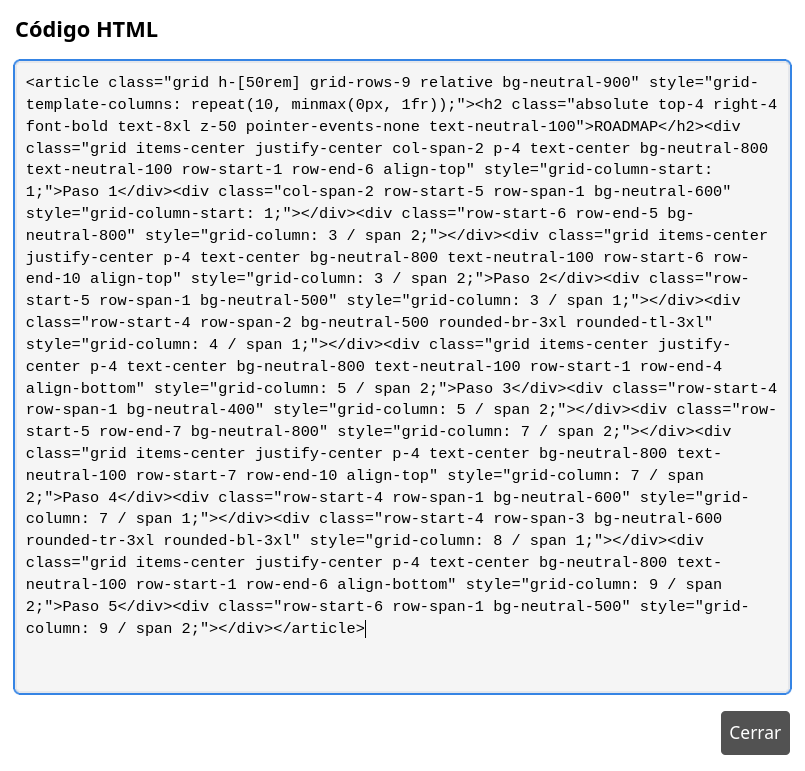

# Roadmap

El obetivo es generar un componente _Roadmap_ para Tailwind CSS. Lo unico que hay que hacer es definir el número de pasos y sus etiquetas y pulsar el botón _Generar_. Automáticamente se creará un _roadmap_ con esos pasos.

Está diseñado para poder añadir hasta 10 pasos, pero debería ser sencillo modificarlo para añadir más.

## Ejemplos de la interfaz



### Diferentes temas

Se adjuntan 9 paletas diferentes:
  * Años 70
  * Ocean
  * Real Betis
  * Pastel
  * Rojo
  * Cielo
  * Vibrante
  * Oscuro
  * Nocturno



Para modificar las paletas simplemente se modifica el fichero `codigo.js` y se cambian las clases de Tailwind.CSS utilizadas.

El primer color es el color de fondo de los pasos, el segundo el color del texto de cada paso, el tercero es el color de fondo del roadmap. Los colores restantes son los que se usan para definir la _carretera_.



```
const paletas = {
  "70s": ["bg-neutral-200", "text-neutral-800", "bg-white", "bg-slate-600", "bg-red-500", "bg-yellow-500"],
  
  "ocean": ["bg-slate-900", "text-slate-200", "bg-violet-950", "bg-lime-400", "bg-green-600", "bg-emerald-700", "bg-cyan-400", "bg-blue-600"],

  "betis": ["bg-white", "text-green-800", "bg-emerald-100", "bg-green-700", "bg-green-600", "bg-green-500"],

  "pastel": ["bg-white", "text-slate-500", "bg-slate-100", "bg-pink-300", "bg-blue-300", "bg-green-300"],

  "rojo": ["bg-white", "text-red-900", "bg-red-50", "bg-red-600", "bg-red-500", "bg-red-400"],

  "cielo": ["bg-white", "text-sky-900", "bg-sky-50", "bg-sky-600", "bg-sky-500", "bg-sky-400"],

  "vibrante": ["bg-white", "text-purple-900", "bg-purple-50", "bg-[#663399]", "bg-purple-600", "bg-yellow-400", "bg-orange-500"],

  "oscuro": ["bg-neutral-800", "text-neutral-100", "bg-neutral-900", "bg-neutral-600", "bg-neutral-500", "bg-neutral-400"],

  "nocturno": ["bg-slate-800", "text-slate-100", "bg-slate-950", "bg-slate-700", "bg-slate-600", "bg-[#ff1493]"]
};
```


## Exportación sencilla

Basta pulsar el botón de _Ver código_ para que se nos muestre el código del _roadmap_.



# Cómo arrancar el proyecto

Una vez descargado el repositorio ve a la carpeta `src` y abre el fichero `index.html` en un navegador. Más fácil imposible 😃.

## Cómo modificar el proyecto
  * El proyecto utiliza Javascript, sin ningún framework, por lo que no hay problema ninguno. La única biblioteca que se utiliza es Tailwind CSS por razones obvias (recuerda: el objetivo era crear un componente para Tailwind CSS).
  * Ejecuta el fichero `./tw.sh` para arrancar Tailwind en modo autónomo y que se procesen las clases CSS que se están usando en el proyecto, generando el fichero `output.css`.
  * Modifica los ficheros que necesites usando un IDE.
